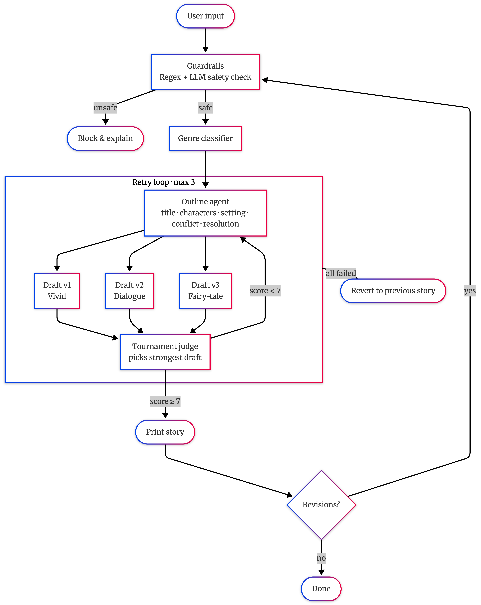

# Bedtime Story Generator

> **Note:** Built and tested with [OpenRouter](https://openrouter.ai) API keys (free-tier access to `gpt-3.5-turbo`), since the native OpenAI API requires a paid account. Should work identically with a real OpenAI key — just set `api_base = "https://api.openai.com/v1"` in `agents.py`.

A multi-agent LLM pipeline that turns any story request into a child-safe bedtime story for ages 5–10.

## Setup

```bash
pip install openai
export OPENAI_API_KEY=sk-or-...
python main.py
```

## How It Works

1. **Outline-first** — a planner agent produces a title, characters, setting, conflict, and resolution before any prose is written. The storyteller expands that skeleton, keeping structure coherent across retries.
2. **Multi-draft tournament** — three style variants (vivid, dialogue-heavy, fairy-tale) are generated from the same outline. A judge reads all three and picks the strongest.

## Pipeline




## Configuration

| Setting | Default | Description |
|---|---|---|
| `MAX_RETRIES` | 3 | Max outline → draft → judge cycles |
| `PASS_THRESHOLD` | 7 | Min score (out of 10) to accept a story |
| `NUM_DRAFTS` | 3 | Style variants per outline |
| `MODEL` | gpt-3.5-turbo | LLM used for all agents |

## Agents

| Agent | Role | Temp |
|---|---|---|
| Guardrails | Regex + LLM safety gate | 0.0 |
| Genre classifier | Maps request → adventure / bedtime / silly / mystery / friendship | 0.0 |
| Outline agent | Plans story skeleton | 0.5 |
| Storyteller ×3 | Expands outline into a full story (one per style variant) | 0.75 |
| Tournament judge | Picks the strongest draft; feeds issues back into next outline | 0.0 |

## Future Scope
 
- **Age-aware generation** — let the user specify their age so vocabulary and themes are calibrated accordingly (simpler language and gentler conflict for younger kids, richer prose for older ones).
- **Streaming + chapter continuation** — stream output word-by-word for a more engaging experience, and support a "keep going" command to extend the story into additional chapters naturally.
- **User profiles** — persist user preferences and story history in a database to enable personalised recommendations and recurring characters across sessions.
- **Prompt refinement** — invest more time tuning the prompts for each agent; in practice, prompt quality has an outsized effect on output quality across the whole pipeline.
 